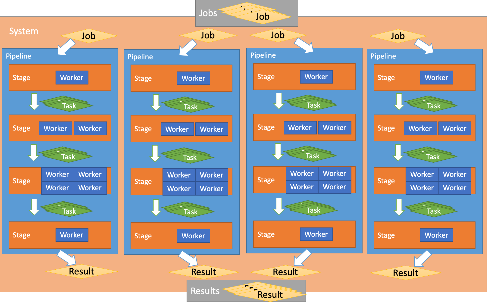

# Pyturbo Package

[](https://badge.fury.io/py/py-turbo)


Author: Lijun Yu

Email: lijun@lj-y.com

A pipeline system for efficient execution.

## Installation

```sh
pip install py-turbo
```

## Abstract



## Demo


See [demo.py](demo.py).

## Version History

See [version.md](docs/version.md).
